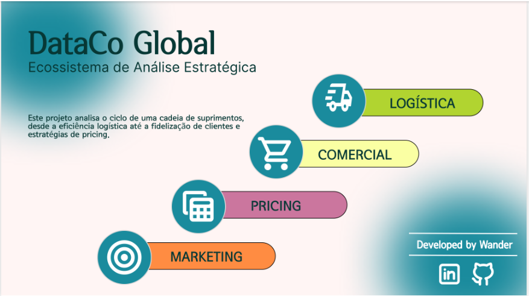

<h1 align="center"> 
Olá, eu sou o Wander Araujo.
</h1>

&nbsp;&nbsp;Sou profissional em transição para a área de Análise de Dados e Business Intelligence, com experiência em liderança operacional, logística e acompanhamento de indicadores de performance.

&nbsp;&nbsp;Atualmente desenvolvo projetos voltados à análise operacional, performance logística, indicadores de negócio e suporte à tomada de decisão.

&nbsp;&nbsp;Busco oportunidades na área de Análise de Dados e Business Intelligence, contribuindo com visão analítica, melhoria de processos, organização das informações e tomada de decisão orientada por dados.

&nbsp;&nbsp;Tenho interesse em transformar dados em insights estratégicos, conectando análise, eficiência operacional e visão de negócio para gerar resultados e apoiar o crescimento das organizações.

##

          

          

##

&nbsp; &nbsp; 

<h2 align="center"> 
Conheça os meus projetos
</h2>

	

